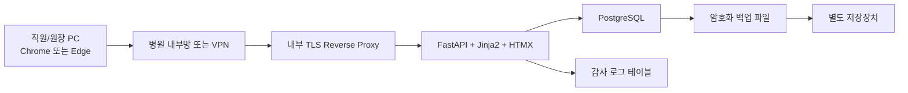
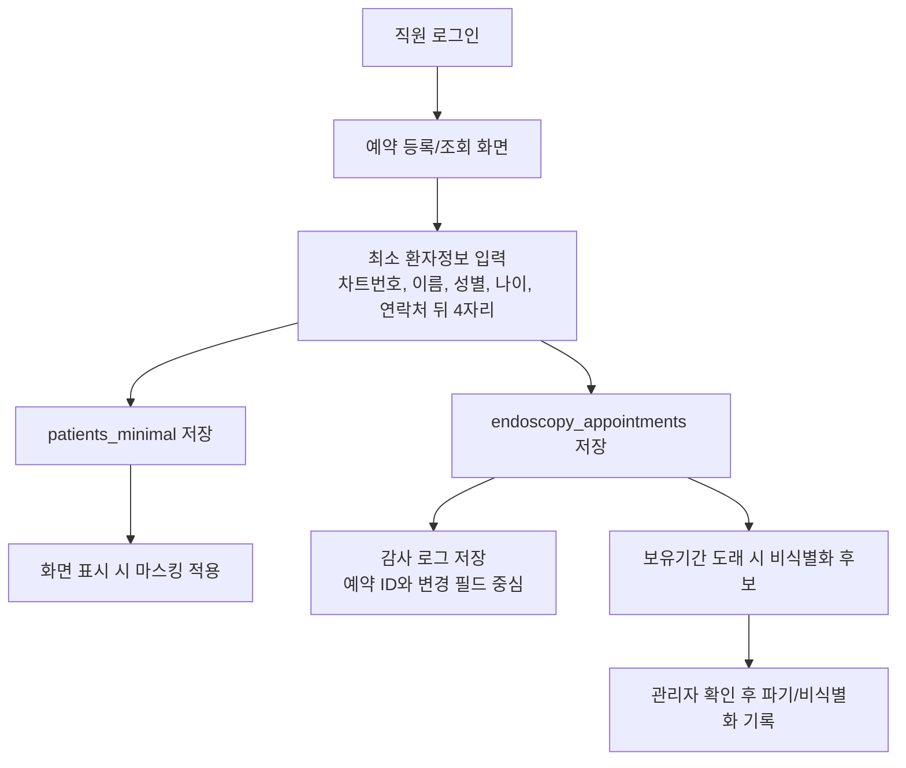
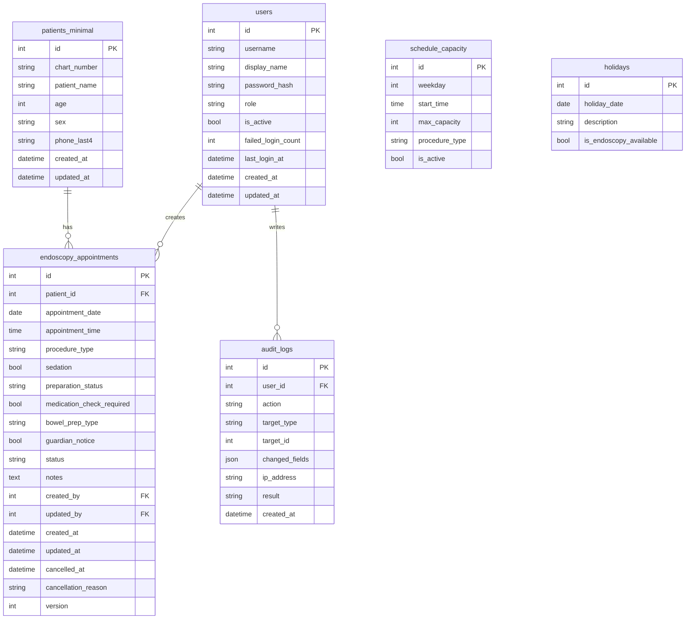

# 내시경 예약·스케줄 관리 웹앱 설계 초안

## 1. 누락되거나 위험한 부분

- 법적 보유기간은 코드에 고정하면 안 된다. 병원 개인정보 처리방침과 법률 검토 후 관리자가 설정한다.
- 실제 운영 전에는 내부망 접속 제한, VPN 정책, 백업 암호 보관자, 퇴사자 계정 비활성화 절차가 문서화되어야 한다.
- 화면 캡처와 출력 제한은 웹앱만으로 완전 차단할 수 없다. 권한 통제, 워터마크, 운영 규정, PC 보안정책을 함께 적용한다.
- 감사 로그에 환자 이름·전화번호를 중복 저장하면 개인정보가 복제된다. 예약 ID와 변경 필드 중심으로 저장한다.
- 약제 중단일수는 앱이 단독 판단하지 않는다. “확인 필요” 플래그만 저장하고 EMR 또는 원장 확인으로 처리한다.
- PostgreSQL 운영 DB와 개발 SQLite DB를 분리해야 한다. 실제 환자 데이터는 테스트 DB에 복사하지 않는다.
- 관리자 예외 등록은 사유 입력과 감사 로그가 필수다.
- 동시 수정은 `version` 컬럼으로 optimistic locking을 적용한다.

## 2. 권장 기술 스택과 선정 이유

선정안: **FastAPI + Jinja2 + HTMX + Bootstrap 계열 CSS + SQLAlchemy + Alembic + PostgreSQL**

- FastAPI: Python 기반이라 유지보수와 자동화 확장이 쉽다.
- Jinja2 + HTMX: React/Next.js보다 빌드 체인이 단순하고, 직원 5명 규모 내부 업무앱에 충분하다.
- SQLAlchemy + Alembic: 운영 DB 스키마 변경 이력을 안전하게 관리한다.
- PostgreSQL: 동시 접속, 백업, 권한 분리, 운영 안정성 면에서 SQLite보다 적합하다.
- Docker Compose: 병원 내부 미니 PC에 배포하기 쉽고 DB와 앱을 분리할 수 있다.

## 3. 전체 시스템 구성도

## 4. 개인정보 처리 흐름

## 5. ERD

## 6. MVP 기능 범위

- 개인 계정 로그인, bcrypt 해시, 실패 횟수 제한
- RBAC: 관리자, 직원, 조회 사용자
- 오늘 일정, 일간 일정, 주간 일정
- 예약 등록, 상세, 수정, 취소
- 동일 환자 동일 날짜 중복 예약 차단
- 시간대 정원 초과 차단, 관리자 예외 등록 사유 기록
- 예약 상태 변경: 예약 → 내원 → 검사 진행 → 검사 완료
- 검색: 이름, 차트번호, 날짜, 검사 종류, 상태
- 사용자 관리: 관리자만 생성/비활성화/비밀번호 초기화
- 감사 로그 조회
- 백업/복구 스크립트와 운영 문서

## 7. 4주 단위 개발 계획

### 1주차
- DB 모델, Alembic migration, 로그인, RBAC, 기본 레이아웃
- 사용자 관리와 초기 관리자 생성 스크립트

### 2주차
- 예약 등록/조회/수정/취소
- 중복 예약, 휴진일, 시간대 정원 검증
- 감사 로그 기본 적용

### 3주차
- 당일 업무 화면, 준비 확인, 검색, 마스킹
- 자동 로그아웃과 동시 수정 충돌 처리
- 백업/복구 스크립트

### 4주차
- pytest, Playwright 핵심 E2E
- 권한/동시성/백업 복구 테스트
- 운영 매뉴얼, 개인정보 점검표, 배포 리허설

## 8. 운영 전 보안 및 개인정보보호 점검항목

- [ ] 외부 인터넷 직접 접속 차단
- [ ] 내부망 TLS 또는 VPN 구성
- [ ] 관리자 계정 2개 이상 준비, 공동 계정 금지
- [ ] 모든 직원 개인 계정 발급과 퇴사자 비활성화 절차 확인
- [ ] 비밀번호 초기화와 초기 비밀번호 변경 절차 확인
- [ ] DB 계정 최소권한 적용
- [ ] 백업 파일 암호화와 복구 테스트 완료
- [ ] 백업 파일명에 환자정보가 없는지 확인
- [ ] 감사 로그에 환자 이름·연락처가 중복 저장되지 않는지 확인
- [ ] 실제 환자 데이터로 개발/테스트하지 않는지 확인
- [ ] 화면 출력/캡처 권한과 운영 규정 확인
- [ ] 장애 시 종이 예약표로 전환하는 업무 절차 준비

